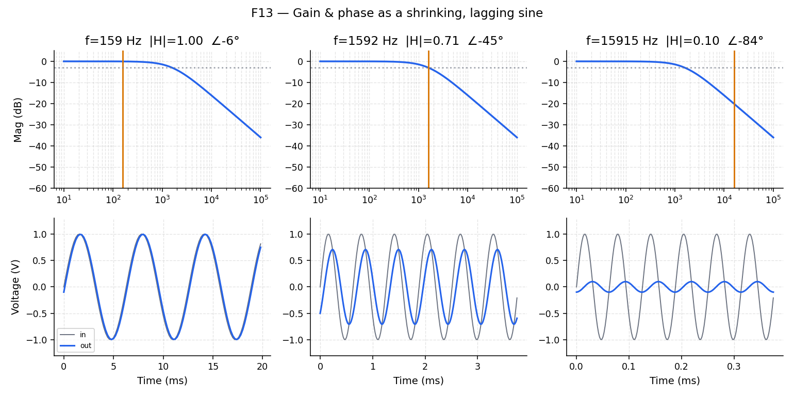
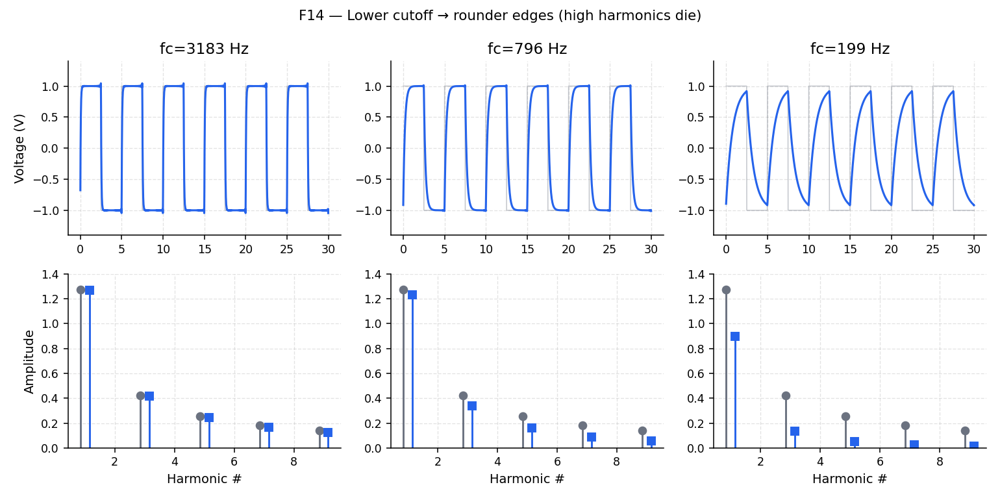
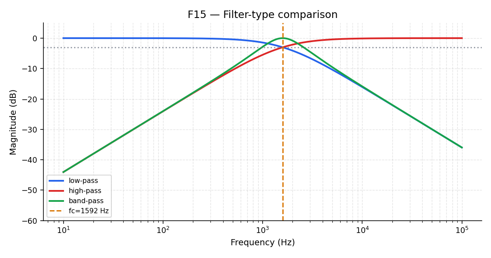

# Filters and Bode plots

**Question this page answers:** *What does a circuit do to a signal?*

## A circuit as a frequency machine

Think of a linear circuit as a machine that takes the frequency-domain recipe of its input and **turns each entry up or down** (and delays it). The report card for that machine is the **Bode plot**:

- **Magnitude** vs frequency — how much comes out ($\lvert H(f)\rvert$), usually in dB
- **Phase** vs frequency — how late it arrives ($\angle H(f)$), in degrees

## The RC low-pass — the first filter everyone draws

A resistor $R$ and capacitor $C$ in the classic low-pass arrangement pass slow signals and attenuate fast ones. Cutoff frequency:

$$
f_c = \frac{1}{2\pi R C}
$$

Magnitude and phase (no calculus required — this is the measured sweep result):

$$
\lvert H(f)\rvert = \frac{1}{\sqrt{1 + (f/f_c)^2}}
\qquad
\angle H(f) = -\arctan(f/f_c)
$$

At $f = f_c$: $\lvert H\rvert = 1/\sqrt{2}$ (−3 dB) and phase = −45°.

### Reading the Bode plot

| Feature | Meaning |
|---------|---------|
| Flat region | Passband — signal comes through almost unchanged |
| −3 dB point | Cutoff $f_c$ by definition |
| −20 dB/decade slope | First-order roll-off (×10 in frequency → ÷10 in amplitude) |
| Phase → −90° | High-frequency asymptote for a single RC |

Only the **product** $RC$ matters — double $R$ and halve $C$, $f_c$ stays put.

## Gain and phase as a picture in time

Pick a frequency on the Bode curve. Drive the filter with a sine at that frequency. The output is still a sine, but **smaller** (gain) and **later** (phase). That is literally what a network analyzer measures.

## Square wave through the filter

Remember Lesson 2: a square is a pile of harmonics. A low-pass **kills the high harmonics**, so the edges round off. Lower the cutoff and the square turns into a soft blob.

### The engineering punchline

Every node on a chip has **parasitic** resistance and capacitance. Every node is therefore one of these filters. That is why clock speeds have a ceiling — and a preview of the parasitic extraction work in AD104.

## Other filter shapes

| Type | Passes | Blocks |
|------|--------|--------|
| Low-pass | Slow | Fast |
| High-pass | Fast | Slow |
| Band-pass | A middle band | Too slow and too fast |

AD201 picks these up again as intentional design blocks.

## Try it

Open [Lab 04 — RC filter & Bode](labs/lab-04-rc-bode-overview.md). At $f_c$, confirm the output is ≈ 0.707× the input and lagging by ≈ 45°.

## Where to go next

| Next course | What you carry forward |
|-------------|------------------------|
| **AD102** | Passives on silicon — fabricating R, C, L |
| **AD103** | Nonlinear devices (diode, MOSFET) in XSchem |
| **AD104** | Layout parasitics (why every node is an RC) |
| **AD202** | Sampling, ADCs — Nyquist for real |

You now have the three plots. Everything later in the analog track assumes you can read them.
