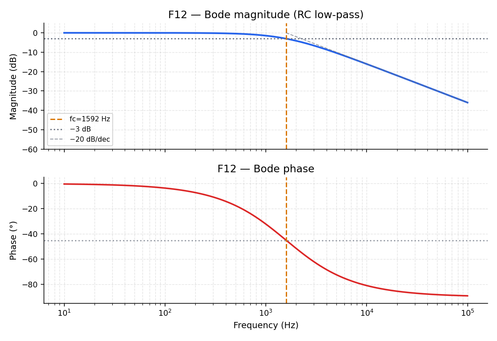

# Filters are tone knobs

**Question this page answers:** *What does a circuit do to a signal?*

The bass and treble knobs on a car stereo don't add new notes — they turn some frequencies up and others down. A **filter** is exactly that: a frequency machine that takes a signal's recipe and turns each entry up or down (and delays it a little). The report card for that machine is the **Bode plot**.

## A circuit as a frequency machine

- **Magnitude** vs frequency — how much comes out ($\lvert H(f)\rvert$), usually in dB
- **Phase** vs frequency — how late it arrives ($\angle H(f)$), in degrees

## The RC low-pass — the first tone knob everyone builds

A resistor $R$ and capacitor $C$ in the classic low-pass arrangement pass slow signals and turn down fast ones — a treble-cut knob. Its cutoff frequency:

$$
f_c = \frac{1}{2\pi R C}
$$

Magnitude and phase (no calculus required — this is the measured sweep result):

$$
\lvert H(f)\rvert = \frac{1}{\sqrt{1 + (f/f_c)^2}}
\qquad
\angle H(f) = -\arctan(f/f_c)
$$

At $f = f_c$: $\lvert H\rvert = 1/\sqrt{2}$ (−3 dB) and phase = −45°.



Only the **product** $RC$ matters — double $R$ and halve $C$, $f_c$ stays put, just like two different amp settings that happen to land on the same tone.

## Write it yourself: compute a filter's response

```python
import numpy as np
import matplotlib.pyplot as plt

R, C = 1_000.0, 100e-9              # 1 kΩ, 100 nF
fc = 1 / (2 * np.pi * R * C)
print(f"cutoff fc ≈ {fc:.0f} Hz")

f = np.logspace(1, 5, 400)          # 10 Hz to 100 kHz, log-spaced
mag = 1 / np.sqrt(1 + (f / fc) ** 2)
mag_db = 20 * np.log10(mag)
phase_deg = -np.rad2deg(np.arctan(f / fc))

fig, (ax1, ax2) = plt.subplots(2, 1, sharex=True, figsize=(7, 5))
ax1.semilogx(f, mag_db)
ax1.axvline(fc, color="orange", linestyle="--")
ax1.axhline(-3, color="gray", linestyle=":")
ax1.set_ylabel("Magnitude (dB)")

ax2.semilogx(f, phase_deg)
ax2.axvline(fc, color="orange", linestyle="--")
ax2.axhline(-45, color="gray", linestyle=":")
ax2.set_ylabel("Phase (°)")
ax2.set_xlabel("Frequency (Hz)")
plt.tight_layout()
plt.show()
```

That's a Bode plot, generated from nothing but the two formulas above. Change `R` and `C` and confirm the cutoff (where the magnitude curve crosses the dashed −3 dB line) always lands where you predict from $f_c = 1/(2\pi RC)$.

## Try it

Open [Lab 04 — RC filter & Bode](labs/lab-04-rc-bode-overview.md). On F12, move R and C and watch $f_c$ track your prediction; double R and halve C and confirm $f_c$ doesn't move.

Next: [Reading a Bode plot](guide/reading-a-bode-plot.md).
