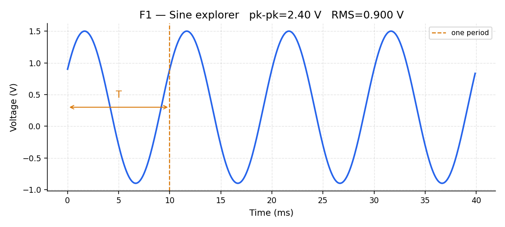
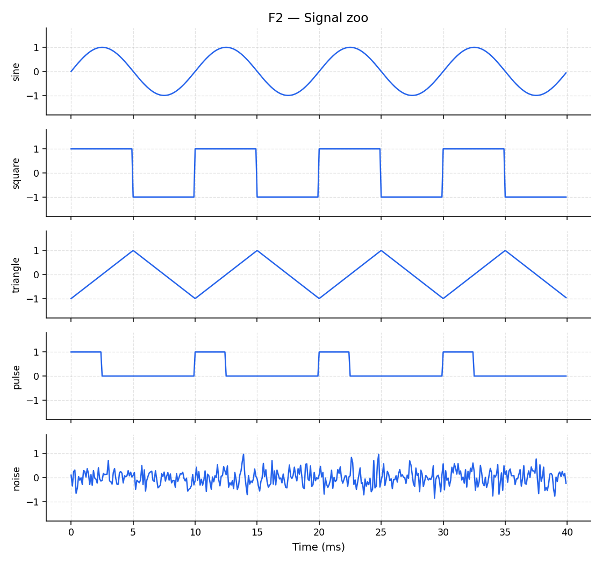
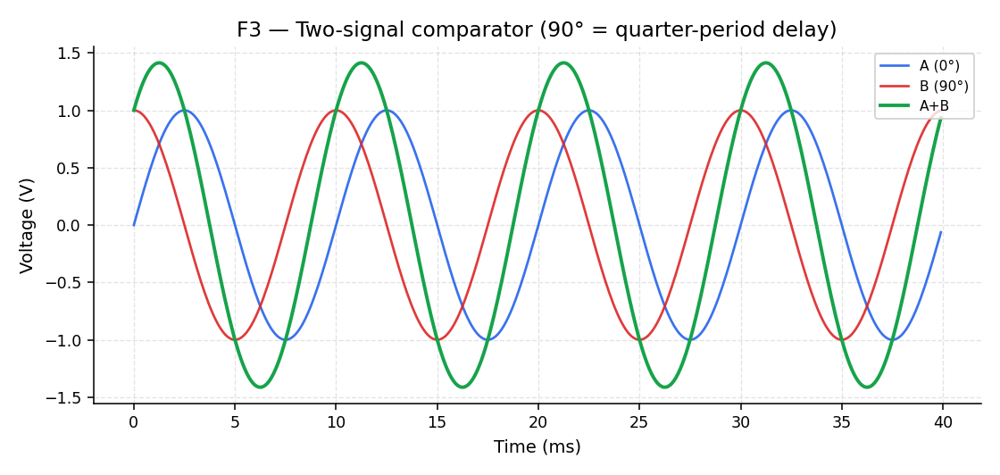

# Signals in time

**Question this page answers:** *What am I actually looking at on an oscilloscope?*

A **signal** is a number that changes with time. On a chip that number is usually a **voltage**. Every wire, every pin, every node carries one. If you can describe that voltage, you can start designing around it.

## The sine wave — the atom of signals

The simplest interesting signal is a sine:

$$
v(t) = A \sin(2\pi f t + \phi) + V_{\mathrm{DC}}
$$

| Symbol | Name | What it means |
|--------|------|----------------|
| $A$ | Amplitude | How far the wave swings from its center (volts) |
| $f$ | Frequency | How many cycles per second (hertz, Hz) |
| $T = 1/f$ | Period | Duration of one cycle (seconds) |
| $\phi$ | Phase | Horizontal shift — where the wave starts |
| $V_{\mathrm{DC}}$ | DC offset | The center line the wave rides on |

### Peak-to-peak and RMS

- **Peak-to-peak** = $2A$ for a pure sine: the full vertical swing.
- **RMS** ("root mean square") is the *effective* value — for a sine with no DC offset, $\mathrm{RMS} = A / \sqrt{2} \approx 0.707\,A$. Power into a resistor depends on RMS, not peak.

## A zoo of shapes

Not every signal is a sine. Clocks are **squares**. ADC ramps are **triangles**. Sensor readouts sit on **noise**. A **pulse train** is a square with a tunable on-time (duty cycle).

Same peak-to-peak value can hide very different shapes. That is the limitation of staring only at a time plot: two waveforms can look "the same height" and still carry completely different information.

## Phase is delay wearing a costume

Two sines of the same frequency can sit shifted relative to each other. That shift is **phase**. Convert it to time:

$$
t_{\mathrm{delay}} = \frac{\phi}{360^\circ} \cdot T
$$

A $90^\circ$ shift at 100 Hz is a 2.5 ms delay — a quarter of the period.

Phase (delay) is why digital timing closure exists, why clocks skew, and why analog "phase margin" will matter later in AD201.

## Why an engineer cares

| Quantity | Everyday use |
|----------|----------------|
| Amplitude vs supply rails | Headroom — will the signal clip? |
| DC offset | Bias / operating point (AD103 will make this precise) |
| Frequency | Bandwidth budgets, sampling rates |
| Phase / delay | Timing, synchronization, stability |

## Try it

Open [Lab 01 — Signal explorer](../labs/lab-01-signal-explorer-overview.md) and drag the sliders on F1–F3 until the readouts match what you expect from the formulas above.

Next: [Building signals](building-signals.md).
