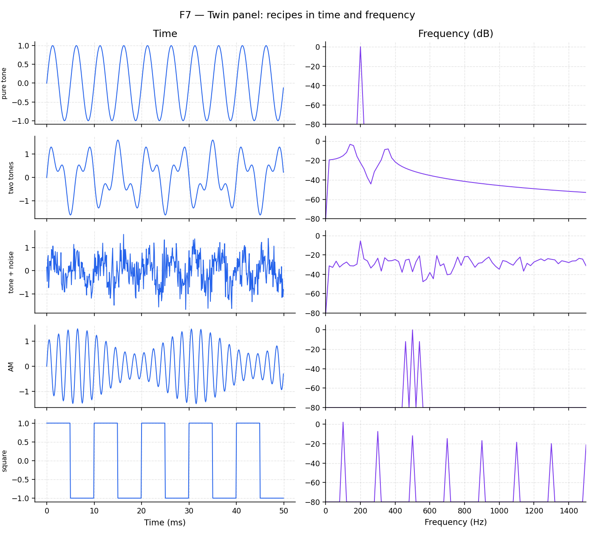

# The FFT as an equalizer

**Question this page answers:** *Is there a machine that reads off a signal's recipe automatically?*

Yes. You've been building waveforms out of sines by hand for two movements now — picking harmonics, picking amplitudes. The **Fast Fourier Transform (FFT)** runs that process backwards: hand it a time waveform, and it hands back the recipe. It's the math behind every equalizer display you've ever seen bounce along to a song.

## The FFT as a machine (not a proof)

Treat the FFT as a black box for now:

```text
  time waveform  ──FFT──►  spectrum (amplitudes vs frequency)
```

You do not need the derivation to use it — `numpy.fft.rfft` does the work in one line. Lab 03 runs it for you and plots the result; the snippet below runs it yourself.



### How to read a spectrum

| Look for | Meaning |
|----------|---------|
| Where peaks sit | Frequencies present in the signal — the notes in the chord |
| How tall peaks are | Relative strength of each tone — how loud that note is in the mix |
| The noise floor | Smallest features you can still see above the hiss |
| Harmonic combs | Distortion, clocks, square-ish shapes — timbre, from the last movement |

## Decibels — why the axis is logarithmic

Human ears (and RF engineers) both perceive *ratios*, not differences — a jump from a whisper to a normal voice feels as big as a jump from a normal voice to a shout, even though the second jump is a much bigger raw voltage change. The **decibel** captures that with a logarithm:

$$
\mathrm{dB} = 20\log_{10}\!\left(\frac{A}{A_{\mathrm{ref}}}\right)
$$

Useful intuition (worth memorizing):

| Linear ratio | dB |
|--------------|-----|
| ×2 | ≈ +6 dB |
| ×10 | +20 dB |
| ×0.5 | ≈ −6 dB |
| ×0.1 | −20 dB |
| $1/\sqrt{2} \approx 0.707$ | −3 dB |

A log axis lets a loud tone and a quiet tone share one plot without the quiet one disappearing into the baseline — exactly why a studio equalizer's meters are marked in dB, not volts.

## Write it yourself: your first FFT

```python
import numpy as np
import matplotlib.pyplot as plt

fs = 10_000
t = np.arange(0, 0.2, 1 / fs)          # a longer window gives a sharper spectrum

# a two-note chord: A4 and E5
v = np.sin(2 * np.pi * 440 * t) + 0.5 * np.sin(2 * np.pi * 659 * t)

spectrum = np.abs(np.fft.rfft(v - v.mean()))
freqs = np.fft.rfftfreq(len(v), d=1 / fs)
spectrum_db = 20 * np.log10(np.maximum(spectrum, 1e-6))

fig, axes = plt.subplots(2, 1, figsize=(7, 6))
axes[0].plot(t * 1e3, v)
axes[0].set_xlabel("Time (ms)")
axes[0].set_ylabel("Voltage (V)")
axes[0].set_title("time domain")

axes[1].plot(freqs, spectrum_db)
axes[1].set_xlim(0, 1000)
axes[1].set_xlabel("Frequency (Hz)")
axes[1].set_ylabel("Magnitude (dB)")
axes[1].set_title("frequency domain")
plt.tight_layout()
plt.show()
```

The top plot is a mess of two overlapping wiggles — hard to tell it's exactly two notes. The bottom plot has two unmistakable peaks at 440 and 659 Hz. That contrast is the entire reason this movement exists.

## Try it

Open [Lab 03 — Spectrum detective](labs/lab-03-spectrum-detective-overview.md). On F7, flip through pure tone / two tones / tone+noise / square and toggle dB / log-freq to see how the view changes.

Next: [Finding a quiet note](guide/finding-a-quiet-note.md).
