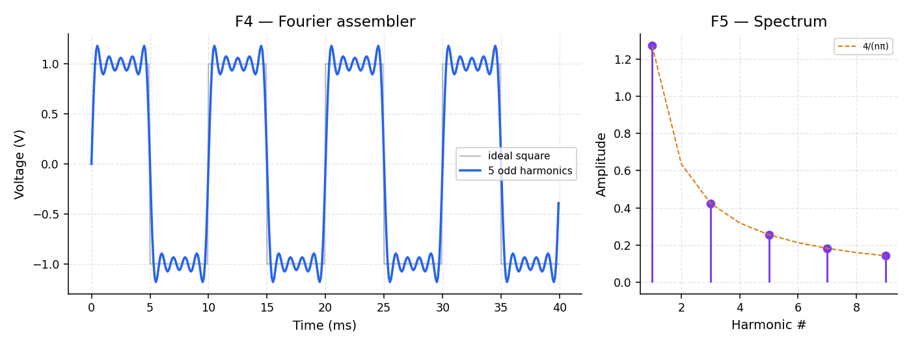
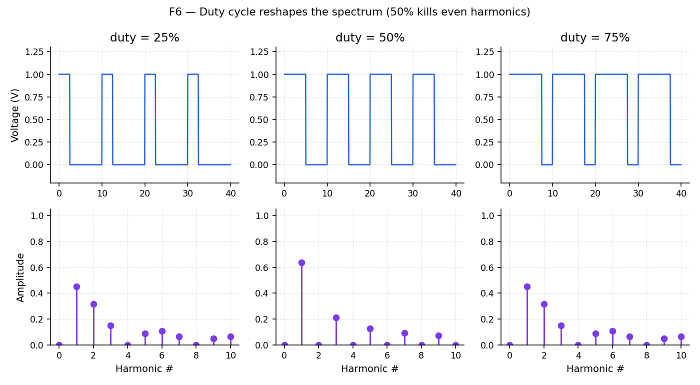

# Lab 02 — Harmonic builder

Full runnable package: [`labs/lab-02-harmonic-builder/`](https://github.com/uoftasic/ad101/tree/main/labs/lab-02-harmonic-builder).

## Prerequisites

- Lab 01 complete
- Read [Building signals](guide/building-signals.md)

## Objectives

- Build a square-ish wave from odd harmonics of a sine
- Read a stem-plot spectrum as the "recipe card" of a waveform
- See how duty cycle creates or kills even harmonics

## Theory (short)

Odd-harmonic square-wave series:

$$
v(t)=\sum_{k=0}^{N}\frac{4}{(2k+1)\pi}\sin\!\big(2\pi(2k+1)f_0 t\big)
$$

Amplitudes follow the $4/(n\pi)$ envelope. At 50% duty, even harmonics of a pulse train are zero.

## Procedure

```bash
mod ad101
cd labs/lab-02-harmonic-builder
python3 src/explore.py
```

### F4 / F5 — Fourier assembler + live spectrum



- **Try this:** Start with only $n=1$. Tick on 3, 5, 7, 9. Drag amplitudes toward (or away from) $4/(n\pi)$.
- **What you should see:** The sum walks toward the gray ideal square. Overshoot appears near edges. The stem plot on the right updates in lockstep; the dashed $4/(n\pi)$ guide is the fingerprint of a square.
- **Why an engineer cares:** A "digital" 1 GHz clock still needs **analog bandwidth far above 1 GHz**. The overshoot you see is the ringing you will meet on real boards.

### F6 — Duty cycle ↔ spectrum



- **Try this:** Sweep duty from 25% → 50% → 75%. Watch the even-numbered stems.
- **What you should see:** At exactly 50%, even harmonics vanish. Off 50%, they return.
- **Why an engineer cares:** Clock spectral content drives **EMI**. Specifying ~50% duty is not cosmetic — it cleans the spectrum.

## Expected results

- With harmonics 1,3,5,7,9 at $4/(n\pi)$: waveform closely matches the ideal square (with Gibbs ringing)
- At 50% duty: even stems ≈ 0; at 25% they are clearly visible
- Status line on F6 reads `even harmonics GONE` at 50%

## Links

- [Lab package](https://github.com/uoftasic/ad101/tree/main/labs/lab-02-harmonic-builder)
- Next lab: [Lab 03 — Spectrum detective](labs/lab-03-spectrum-detective-overview.md)
