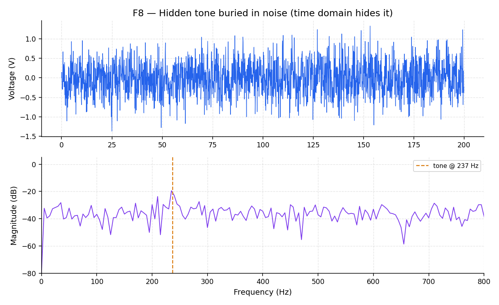
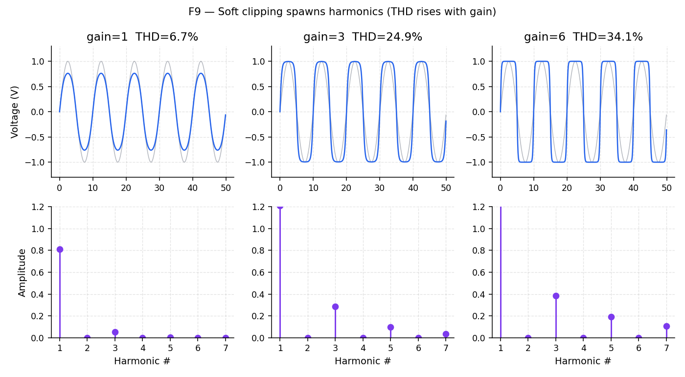
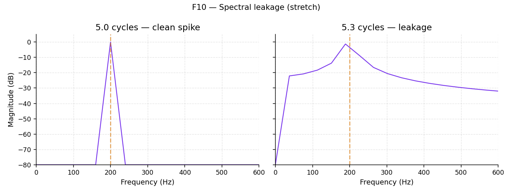
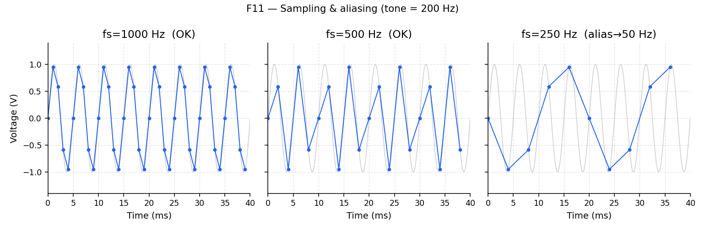

# Lab 03 — Spectrum detective

Full runnable package: [`labs/lab-03-spectrum-detective/`](https://github.com/uoftasic/ad101/tree/main/labs/lab-03-spectrum-detective).

## Prerequisites

- Lab 02 complete
- Read Movement III: [The FFT as an equalizer](guide/the-fft-as-an-equalizer.md) → [Finding a quiet note](guide/finding-a-quiet-note.md) → [Distortion and THD](guide/distortion-and-thd.md) → [Sampling fast enough](guide/sampling-fast-enough.md)
- Know the dB table from [Reading plots](reference/reading-plots.md)

## Objectives

- Match time-domain recipes to their spectra
- Find a tone buried in noise and confirm its frequency
- Watch distortion create harmonics and read a THD number
- See aliasing when sample rate drops below $2f$

## Theory (short)

FFT: time → spectrum. Amplitude in dB: $20\log_{10}(A/A_{\mathrm{ref}})$.  
THD is $\sqrt{A_2^2+A_3^2+\cdots}/A_1$.  
Nyquist: $f_s > 2 f_{\max}$.

## Procedure

```bash
mod ad101
cd labs/lab-03-spectrum-detective
python3 src/explore.py                 # all figures
python3 src/explore.py --figure f8     # just the hunt
python3 src/check.py --guess <Hz>      # confirm your find
```

### F7 — Twin panel


- **Try this:** Flip through pure tone / two tones / tone+noise / AM / square. Toggle dB and log-freq.
- **What you should see:** Two tones → two spikes. Square → odd-harmonic comb. AM → carrier with sidebands. dB reveals small peaks the linear axis hides.
- **Why an engineer cares:** Identifying a signal by the **shape of its spectrum** is a core debug skill.

### F8 — Hidden-tone hunt



- **Try this:** Raise noise until the time plot is garbage. Read the spike frequency off the spectrum. Confirm:

```bash
python3 src/check.py --guess 237
```

- **What you should see:** Time domain hides the tone; frequency domain does not. Lowering noise makes both views clearer.
- **Why an engineer cares:** This is how you track **60 Hz hum** or a clock coupling into a sensitive analog node.

### F9 — Distortion & THD



- **Try this:** Raise the gain into $\tanh$. Watch harmonics sprout; read the THD %.
- **What you should see:** Soft clipping flattens peaks; odd harmonics grow; THD climbs from ~0% toward tens of percent.
- **Why an engineer cares:** Linearity / THD is on every amplifier datasheet — a hand-off to AD103 and AD201.

### F10 — Spectral leakage *(stretch)*



- **Try this:** Set cycles to 5.0 (clean), then 5.3 (smeared). Enable Hann window.
- **What you should see:** Non-integer cycles smear the spike; Hann reduces the skirts.
- **Why an engineer cares:** Explains why real measured spectra look soft instead of like textbook sticks.

### F11 — Sampling & aliasing



- **Try this:** Drop sample rate below 400 Hz for a 200 Hz tone.
- **What you should see:** Status flips to `ALIASED`; a bogus slow sine appears; the spectrum peak folds below Nyquist.
- **Why an engineer cares:** Choosing an ADC sample rate — the setup for AD202.

## Expected results

- `check.py --guess 237` prints `Correct!`
- F9 at gain ≈ 1: THD near 0%; at gain ≈ 6: THD clearly larger
- F11 at $f_s = 250$ Hz for a 200 Hz tone: aliased / apparent frequency near 50 Hz

## Links

- [Lab package](https://github.com/uoftasic/ad101/tree/main/labs/lab-03-spectrum-detective)
- Next lab: [Lab 04 — RC filter & Bode](labs/lab-04-rc-bode-overview.md)
